# Cloud Office Print Node: User Guide

Generate and process documents inside n8n: feel the power of Cloud Office Print without leaving your workflow.

Prefer to jump straight in? Import a ready-made workflow from the [`example`](example/) folder for each resource.

## Contents

- [Cloud Office Print Node: User Guide](#cloud-office-print-node-user-guide)
  - [Contents](#contents)
  - [Before you start](#before-you-start)
  - [1. Install the node](#1-install-the-node)
  - [2. Add your credential](#2-add-your-credential)
  - [3. Add the node](#3-add-the-node)
  - [4. Give the node a file](#4-give-the-node-a-file)
  - [5. Actions and fields](#5-actions-and-fields)
    - [Document Generation](#document-generation)
    - [PDF Operation](#pdf-operation)
    - [Password Protect Document](#password-protect-document)
    - [PDF Compare](#pdf-compare)
  - [6. Save the result as a file](#6-save-the-result-as-a-file)
  - [7. Debug Mode](#7-debug-mode)
  - [For more information visit the official documentation.](#for-more-information-visit-the-official-documentation)

## Before you start

You need:

- A running n8n instance.
- A Cloud Office Print API key. Get one at <https://www.united-codes.com/products/cloudofficeprint>.

## 1. Install the node

Install the node with npm:

```bash
npm install n8n-nodes-cloudofficeprint
```

## 2. Add your credential

1. Add a credential and pick **Cloud Office Print API**.
2. Fill in the fields.
3. Click **Save**. n8n tests the connection and shows a green check when it works.

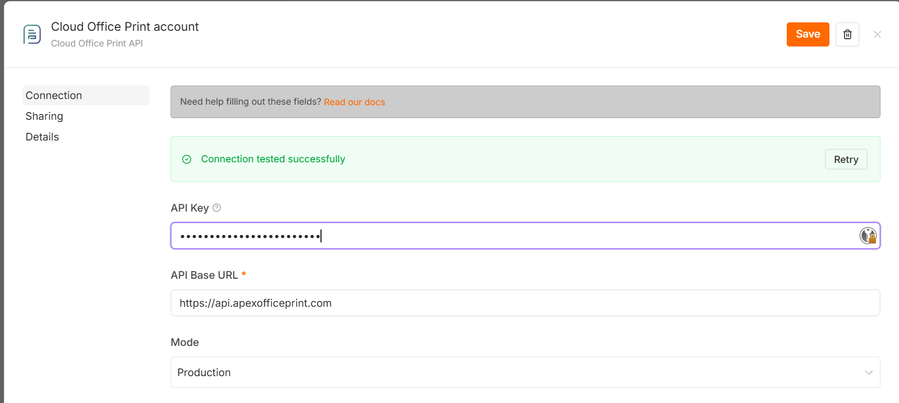

| Field | What to enter |
| --- | --- |
| **API Key** | Your Cloud Office Print API key. |
| **API Base URL** | The API endpoint. |
| **Mode** | `Production` or  `Development` mode. |

## 3. Add the node

1. On the canvas, click **+** to add a node.
2. Search **Cloud Office Print** and select it.

   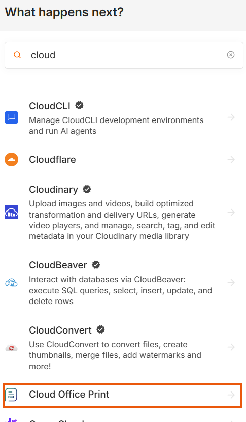

3. Pick an action you want to use.

   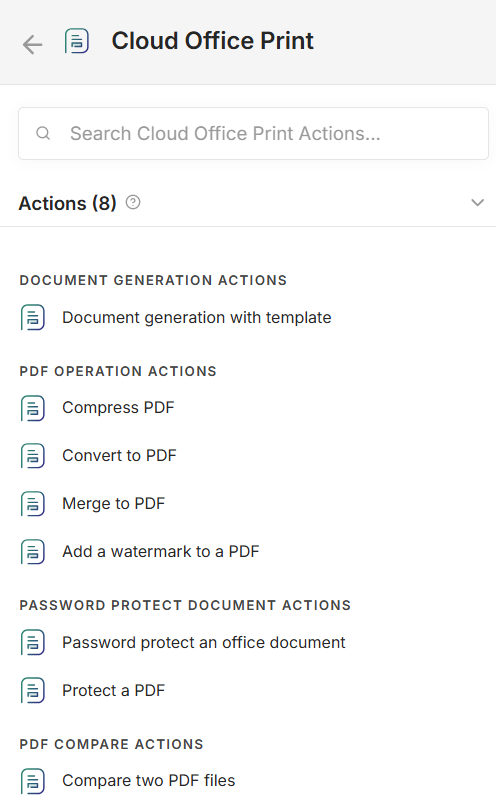

Each action maps to a **Resource** and an **Operation**:

| Resource | Operations |
| --- | --- |
| **Document Generation** | Document Generation |
| **PDF Operation** | Convert to PDF, Compress PDF, Merge to Single PDF File, PDF Watermark |
| **Password Protect Document** | Password Protect Office Documents, Password Protect PDF |
| **PDF Compare** | Compare Two PDF Files |

## 4. Give the node a file

Every action takes files the same way. In the **File** section, click **Add File** and fill in:

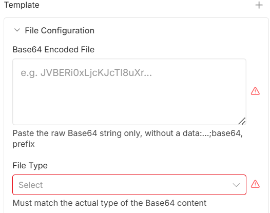

| Field | What to enter |
| --- | --- |
| **Base64 Encoded File** | The file content as a raw Base64 string. |
| **File Type** | The file's type, for example `docx`, `pdf`. Hidden when only one type is allowed. |

Notes:

- Paste the raw Base64 only. No `data:...;base64,` prefix.
- File Type must match the actual file.


## 5. Actions and fields

Every field has a short help text. Hover the **?** next to a field's label to read it for more information.

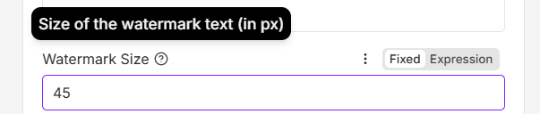

### Document Generation

Fills the tags in a template with your JSON data and exports the result.

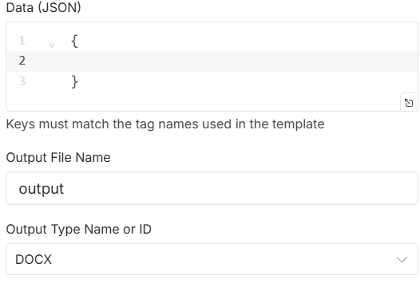

| Field | What to enter |
| --- | --- |
| **File** | The template. One file. Allowed: `docx`, `docm`, `xlsx`, `xlsm`, `pptx`, `pptm`, `html`, `md`, `txt`, `csv`, `pdf`, `ics`, `ifb`, `xml`. |
| **Data (JSON)** | The data that fills the template tags. |
| **Output File Name** | Name of the generated file, without extension. |
| **Output Type** | The format to export to. The list changes with the template type. A `docx` template can export to `pdf`, `docx`, `html`, `txt`, and more. |

**Example**

Fill a `.docx` template containing `Dear {customer}, your invoice total is {total}.` and export it as a PDF:

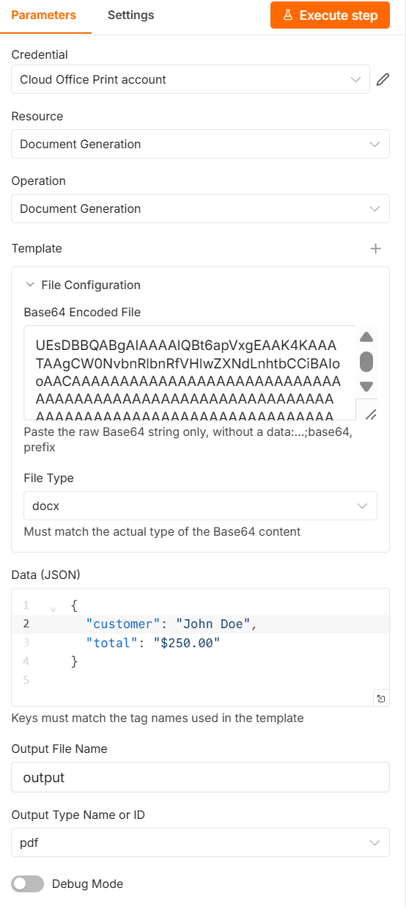

- **Template**: the `.docx` as Base64, with **File Type** `docx`.
- **Data (JSON)**: `{ "customer": "John Doe", "total": "$250.00" }`, keys matching the tag names.
- **Output Type**: `pdf`.

The node returns a PDF that reads *Dear John Doe, your invoice total is $250.00.*

### PDF Operation

**Convert to PDF** turns one file into a PDF.

| Field | What to enter |
| --- | --- |
| **File** | One file. Allowed: `docx`, `docm`, `xlsx`, `xlsm`, `pptx`, `pptm`, `html`, `md`, `txt`, `csv`, `pdf`, `ics`, `ifb`, `xml`. |

**Compress PDF** reduces a PDF's size.

| Field | What to enter |
| --- | --- |
| **File** | One PDF. |

**Merge to Single PDF File** converts and joins several files into one PDF, in order.

| Field | What to enter |
| --- | --- |
| **Files** | Two or more files. Click **Add File** for each. Office files and images are converted and appended. |

**PDF Watermark** writes text diagonally across every page.

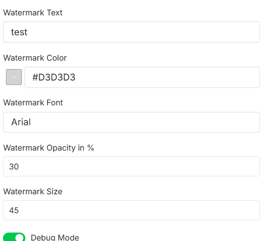

| Field | What to enter |
| --- | --- |
| **File** | One PDF. |
| **Watermark Text** | The text to stamp. |
| **Watermark Color** | Color of the text. |
| **Watermark Font** | Font name. |
| **Watermark Opacity in %** | `0` to `100`. |
| **Watermark Size** | Text size in px, `1` to `1000`. |

**Example**

Stamp every page of a PDF with a diagonal grey watermark:

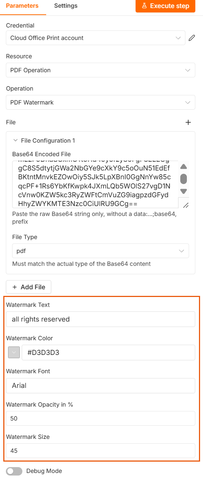

- **File**: the PDF as Base64, with **File Type** `pdf`.
- **Watermark Text**: `all rights reserved`.
- **Watermark Color** `#D3D3D3`, **Opacity** `50`, **Size** `45`.

The node returns the PDF with the watermark stamped diagonally on every page.

### Password Protect Document

**Password Protect Office Documents** locks a Word, Excel, or PowerPoint file.

| Field | What to enter |
| --- | --- |
| **File** | One `docx`, `xlsx`, or `pptx` file. |
| **Password** | Password needed to open the document. |

**Password Protect PDF** locks a PDF.

| Field | What to enter |
| --- | --- |
| **File** | One PDF. |
| **Read Password** | Password needed to open the PDF. Leave empty to skip. |
| **Modify Password** | Password needed to edit the PDF. Leave empty to skip. |

### PDF Compare

Compares two PDFs and returns a PDF showing the differences.

| Field | What to enter |
| --- | --- |
| **PDF File - 1** | The first PDF. |
| **PDF File - 2** | The second PDF. |

## 6. Save the result as a file

The action returns the result as Base64. To save or download it, add a **Convert to File** node after it and set the operation to **Move Base64 String to File**.

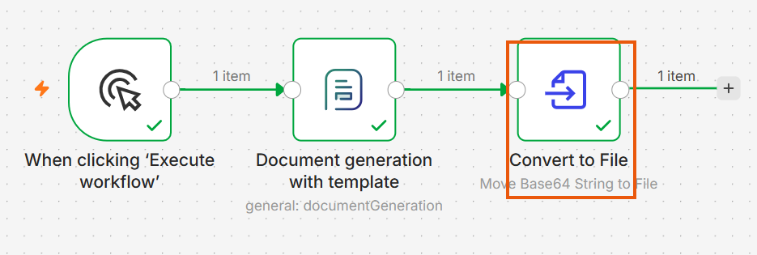

## 7. Debug Mode

Every action has a **Debug Mode** toggle at the bottom.

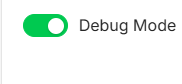

Turn it **on** to return the request payload the node would send, without calling Cloud Office Print. Use it to check your input, or attach the payload when you contact support.
Turn it **off** to run the action for real.

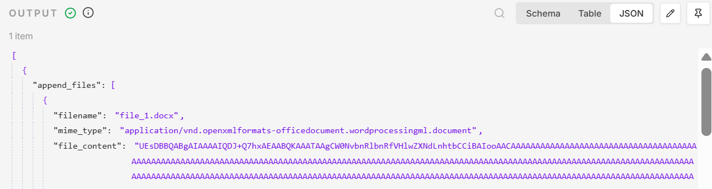

## For more information visit the [official documentation](https://www.apexofficeprint.com/docs/).
