# Cloud Office Print Node: User Guide

Generate and process documents inside n8n: feel the power of Cloud Office Print without leaving your workflow.

Prefer to jump straight in? Import a ready-made workflow from the [`example`](example/) folder for each resource.

## Contents

- [Cloud Office Print Node: User Guide](#cloud-office-print-node-user-guide)
  - [Contents](#contents)
  - [Before you start](#before-you-start)
  - [1. Install the node](#1-install-the-node)
  - [2. Add your credential](#2-add-your-credential)
  - [3. Add the node](#3-add-the-node)
  - [4. Give the node a file](#4-give-the-node-a-file)
  - [5. Actions and fields](#5-actions-and-fields)
    - [Document Generation](#document-generation)
    - [PDF Operation](#pdf-operation)
    - [Password Protect Document](#password-protect-document)
    - [PDF Compare](#pdf-compare)
  - [6. Getting the result](#6-getting-the-result)
  - [7. Debug Mode](#7-debug-mode)
  - [For more information visit the official documentation.](#for-more-information-visit-the-official-documentation)

## Before you start

You need:

- A running n8n instance.
- A Cloud Office Print API key. Get one at <https://www.united-codes.com/products/cloudofficeprint>.

## 1. Install the node

Install the node with npm:

```bash
npm install n8n-nodes-cloudofficeprint
```

## 2. Add your credential

1. Add a credential and pick **Cloud Office Print API**.
2. Fill in the fields.
3. Click **Save**. n8n checks that the API Base URL is reachable and shows a green check. The key itself is only checked on the first real request, so a green check does not mean the key is valid.

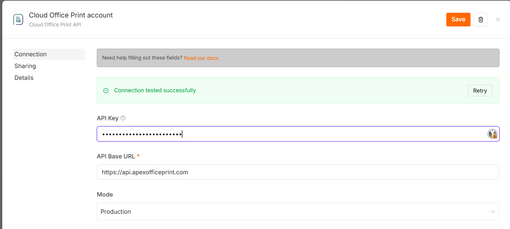

| Field | What to enter |
| --- | --- |
| **API Key** | Your Cloud Office Print API key. Required for the Cloud Office Print and APEX Office Print API URLs. Optional on an on-premise APEX Office Print server that does not require a key. |
| **API Base URL** | The API endpoint. |
| **Mode** | `Production` or  `Development` mode. |

## 3. Add the node

1. On the canvas, click **+** to add a node.
2. Search **Cloud Office Print** and select it.

   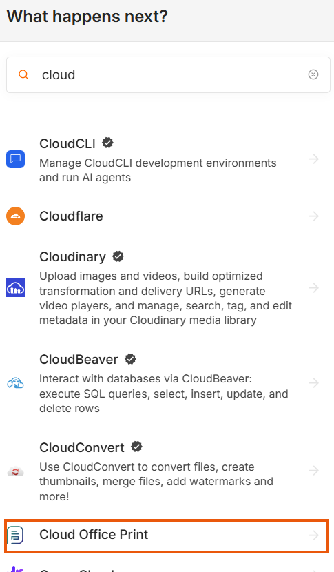

3. Pick an action you want to use.

   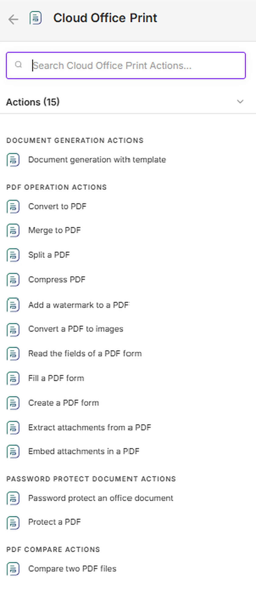

Each action maps to a **Resource** and an **Operation**:

| Resource | Operations |
| --- | --- |
| **Document Generation** | Document Generation |
| **PDF Operation** | Convert to PDF, Merge to Single PDF File, Split PDF, Compress PDF, PDF Watermark, PDF to Image, Read PDF Form Fields, Fill PDF Form, Create PDF Form, Extract Attachments From PDF, Embed Attachments in PDF |
| **Password Protect Document** | Password Protect Office Documents, Password Protect PDF |
| **PDF Compare** | Compare Two PDF Files |

## 4. Give the node a file

Every action takes its files in a section named after the file it needs: **Template** for Document Generation and Create PDF Form, **PDF** for Embed Attachments in PDF, **Original PDF** and **Changed PDF** for PDF Compare, and no prefix for the rest.

Start at **Source**. It decides how the file reaches Cloud Office Print, and the fields below it change to match.

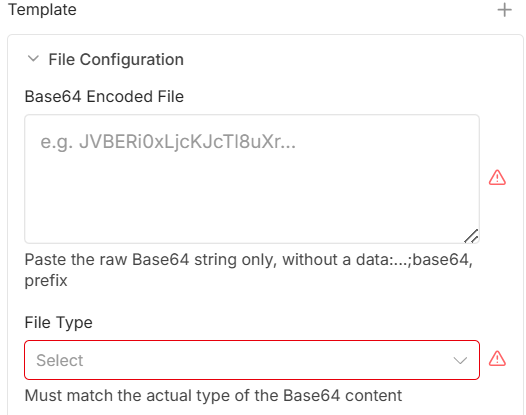

| Source | What to enter |
| --- | --- |
| **Input Binary Field** | Name of the binary field on the incoming item that holds the file, `data` unless the node before it was told otherwise. Use it to take a file straight from Google Drive, HTTP Request, Read/Write Files or any earlier node. |
| **URL** | A public `http(s)` link. Cloud Office Print downloads the file itself. The link must be reachable from the internet, not just from your n8n instance. |
| **Base64** | The file content as a raw Base64 string, pasted in or taken from an expression. |

**File Type** comes last and is required for all three sources.

Notes:

- File Type must match the actual file. Cloud Office Print does not guess it, and the field lists only the types the operation accepts. It is hidden when the operation takes a single type.
- For Base64, paste the raw string only. No `data:...;base64,` prefix.
- Merge to Single PDF File and Embed Attachments in PDF take a list rather than one slot: click **Add Files** or **Add Attachments** once per file, and each entry picks its own source.
- **URL** is the cheapest option for large files, since the file is never carried through the workflow.


## 5. Actions and fields

Every field has a short help text. Hover the **?** next to a field's label to read it for more information.

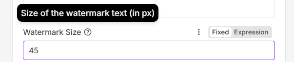

### Document Generation

Fills the tags in a template with your JSON data and exports the result.

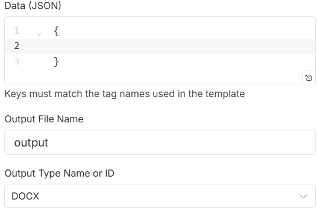

| Field | What to enter |
| --- | --- |
| **Template** | The template. One file. Allowed: `docx`, `docm`, `xlsx`, `xlsm`, `pptx`, `pptm`, `html`, `md`, `txt`, `csv`, `pdf`, `ics`, `ifb`, `xml`. |
| **Data (JSON)** | The data that fills the template tags. |
| **Output File Name** | Name of the generated file, without extension. |
| **Output Type** | The format to export to. The list changes with the template type. A `docx` template can export to `pdf`, `docx`, `html`, `txt`, and more. |

Two output types return data instead of a document, as JSON on the item:

- `count_tags` lists the tags the template contains and how often each one appears. Run it once when you do not know what a template expects.
- `meta_data` returns the template's own metadata, such as its author, title and page count.

**Example**

Fill a `.docx` template containing `Dear {customer}, your invoice total is {total}.` and export it as a PDF:

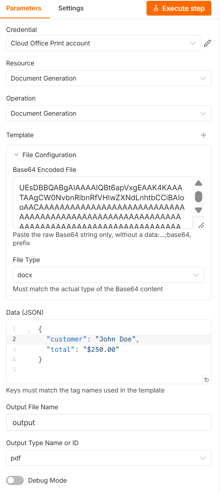

- **Template**: the `.docx`, with **File Type** `docx`.
- **Data (JSON)**: `{ "customer": "John Doe", "total": "$250.00" }`, keys matching the tag names.
- **Output Type**: `pdf`.

The node returns a PDF that reads *Dear John Doe, your invoice total is $250.00.*

### PDF Operation

**Convert to PDF** turns one file into a PDF.

| Field | What to enter |
| --- | --- |
| **File** | One file. Allowed: `docx`, `docm`, `xlsx`, `xlsm`, `pptx`, `pptm`, `html`, `md`, `txt`, `csv`, `pdf`, `ics`, `ifb`, `xml`. |

**Merge to Single PDF File** converts and joins several files into one PDF, in order.

| Field | What to enter |
| --- | --- |
| **Files** | Two or more files. Click **Add Files** for each. Office files and images are converted and appended. |

**Split PDF** `Available from: v0.2.0` cuts one PDF into several. Two or more resulting files come back together as a zip.

| Field | What to enter |
| --- | --- |
| **File** | One PDF. |
| **Split By** | `Every Page` for one PDF per page, `Number of Pages` for a fixed count, or `Text on the Page` to cut where a phrase appears. |
| **Pages per File** | With `Number of Pages`: how many pages go into each returned PDF. |
| **Text That Starts a New File** | With `Text on the Page`: the phrase that marks the first page of each document, for example `Invoice No`. Separate alternatives with a double pipe. |
| **Cut After the Matching Page** | With `Text on the Page`: turn it on when the phrase is a footer or a total, so the matching page ends a file instead of starting one. |

**Compress PDF** reduces a PDF's size.

| Field | What to enter |
| --- | --- |
| **File** | One PDF. |

**PDF Watermark** writes text diagonally across every page.

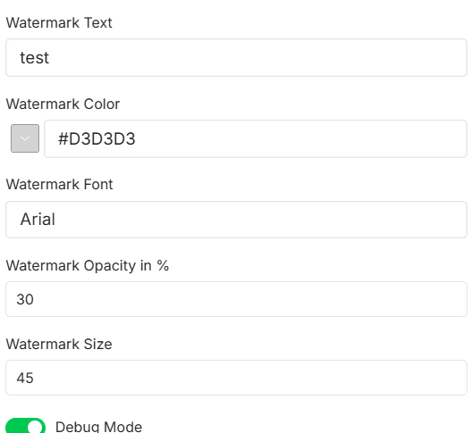

| Field | What to enter |
| --- | --- |
| **File** | One PDF. |
| **Watermark Text** | The text to stamp. |
| **Watermark Color** | Color of the text. |
| **Watermark Font** | Font name. |
| **Watermark Opacity in %** | `0` to `100`. |
| **Watermark Size** | Text size in px, `1` to `1000`. |

**Example**

Stamp every page of a PDF with a diagonal grey watermark:

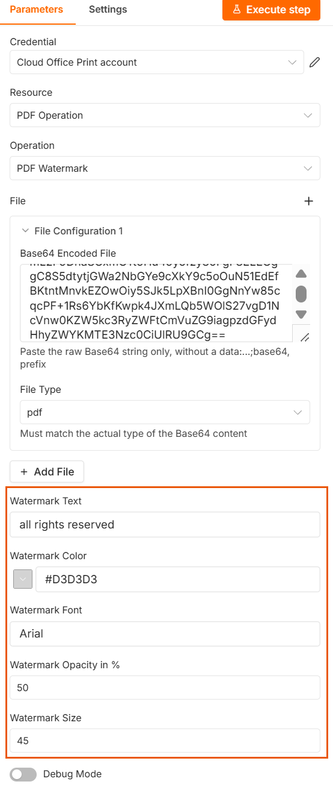

- **File**: the PDF, with **File Type** `pdf`.
- **Watermark Text**: `all rights reserved`.
- **Watermark Color** `#D3D3D3`, **Opacity** `50`, **Size** `45`.

The node returns the PDF with the watermark stamped diagonally on every page.

**PDF to Image** `Available from: v0.2.0` renders the pages of a PDF as JPEG images. A one-page PDF returns the image itself, more pages return a zip of them.

| Field | What to enter |
| --- | --- |
| **File** | One PDF. |
| **Resolution in DPI** | How sharply the pages are rendered, `1` to `1200`. `300` suits print, `96` suits the screen. |

**Read PDF Form Fields** `Available from: v0.2.0` tells you what an existing PDF form contains. Run it before Fill PDF Form to learn the field names. See [read fields from PDF forms](https://www.apexofficeprint.com/docs/pdf-operations/pdf-forms#read-fields-from-pdf-forms) and [identifying PDF form fields](https://www.apexofficeprint.com/docs/pdf-operations/pdf-forms#identifying-pdf-form-fields) for more info.

| Field | What to enter |
| --- | --- |
| **File** | One PDF. |
| **Return** | `Field Names and Values as JSON` for every field with its current value, `XFA Form Structure as JSON` for an XFA form's names, values and types, or `PDF With the Names Marked on the Fields` for a copy of the PDF that shows each field's own name. |
| **Output File Name**, **Output Binary Field** | Shown only for the marked PDF, since the two JSON options return data rather than a file. |

**Fill PDF Form** `Available from: v0.2.0` writes values into the fields of an existing PDF form. See [filling PDF forms](https://www.apexofficeprint.com/docs/pdf-operations/pdf-forms#filling-pdf-forms).

| Field | What to enter |
| --- | --- |
| **File** | One PDF that already has form fields. |
| **Data (JSON)** | The field names and values, wrapped in `aop_pdf_form_data`. |
| **Flatten the Form** | Lock the fields so the filled values can no longer be edited. |
| **Fill Font** | Font for the values being written in. Leave empty to keep whatever the form itself specifies. |

Text fields take a string, checkboxes `true` or `false`, and radio buttons the value of the chosen option. When several fields share one name, give an array:

```json
{
  "aop_pdf_form_data": [
    { "first_name": "John", "agree": true }
  ]
}
```

**Create PDF Form** `Available from: v0.2.0` builds a fillable PDF from a Word template that contains `{?form ...}` tags. See [PDF forms](https://www.apexofficeprint.com/docs/pdf-operations/pdf-forms) for the tag syntax.

| Field | What to enter |
| --- | --- |
| **Template** | One `docx` or `docm` file. |
| **Data (JSON)** | Values for the tags in the template, keyed by tag name. A `{?form name}` tag takes an object describing the field to build there, with `type` and `name` required. Ordinary tags take their usual values, so one template can mix form fields with normal text, images and loops. |
| **Flatten the Form** | Lock every field in the finished PDF. |

Field types are `text`, `password`, `checkbox`, `radio`, `dropdown`, `combobox`, `listbox` and `pushbutton`. All of them accept `width`, `height` and `lock`. A `{?form first_name}` tag is filled by:

```json
{
  "first_name": { "type": "text", "name": "first_name", "value": "John" }
}
```

The output is always a PDF.

**Extract Attachments From PDF** `Available from: v0.2.0` returns the files attached inside a PDF.

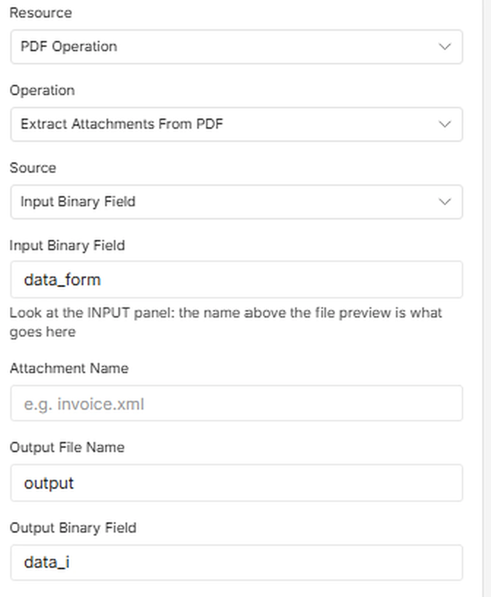

| Field | What to enter |
| --- | --- |
| **File** | One PDF. |
| **Attachment Name** | Name of the single attachment to return, for example `invoice.xml`. Leave empty to get them all. |

**Embed Attachments in PDF** `Available from: v0.2.0` attaches one or more files inside a PDF.

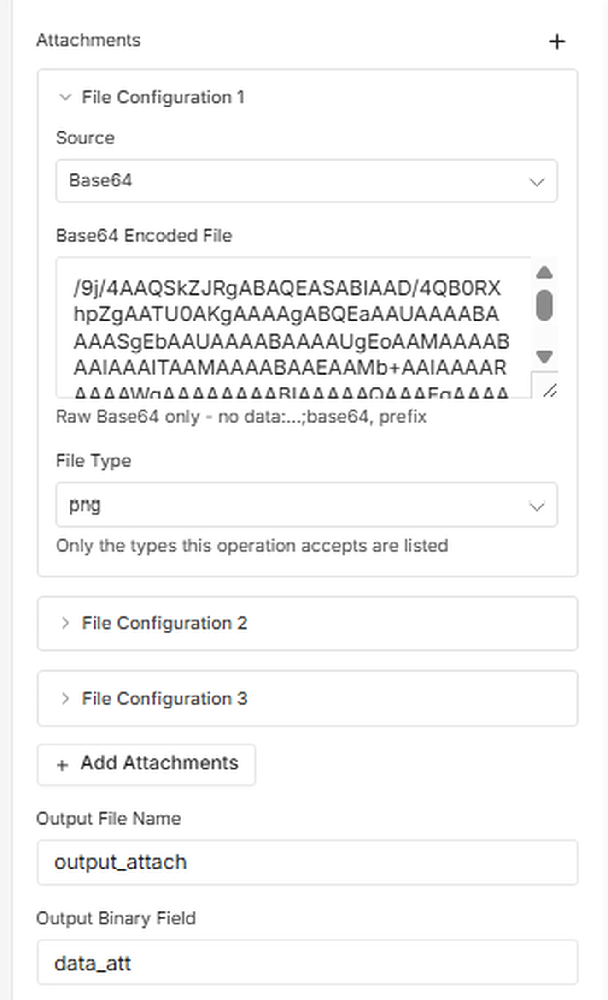

| Field | What to enter |
| --- | --- |
| **PDF** | The PDF to attach the files to. |
| **Attachments** | The files to attach. Click **Add Attachments** for each. |

### Password Protect Document

**Password Protect Office Documents** locks a Word, Excel, or PowerPoint file. The result keeps the type it came in as.

| Field | What to enter |
| --- | --- |
| **File** | One `docx`, `xlsx`, or `pptx` file. |
| **Open Password** | Password needed to open the document. Office encrypts the whole file, so without it the contents cannot be read at all. |

**Password Protect PDF** locks a PDF.

| Field | What to enter |
| --- | --- |
| **File** | One PDF. |
| **Open Password** | Password needed to open the PDF at all. Leave empty to let anyone open it and only restrict editing. |
| **Edit Password** | Password needed to change the PDF. Readers can still open and print it without this. Leave empty to skip. |

### PDF Compare

Compares two PDFs and returns a PDF showing the differences.

| Field | What to enter |
| --- | --- |
| **Original PDF** | The PDF to compare against. |
| **Changed PDF** | The PDF whose differences you want to see. |

## 6. Getting the result

The action returns the finished file as binary data on the item, so it can go straight into any node that takes a file: Read/Write Files from Disk, Google Drive, Send Email, or the next Cloud Office Print action.

| Field | What to enter |
| --- | --- |
| **Output File Name** | Name of the file, without the extension. The extension is added for you from the output type. |
| **Output Binary Field** | Name of the binary field the file is written to. Leave it as `data` unless a later node expects a different name. |

## 7. Debug Mode

Every action has a **Debug Mode** toggle at the bottom.

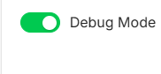

Turn it **on** to return the request payload the node would send, without calling Cloud Office Print. Use it to check your input, or attach the payload when you contact support.
Turn it **off** to run the action for real.

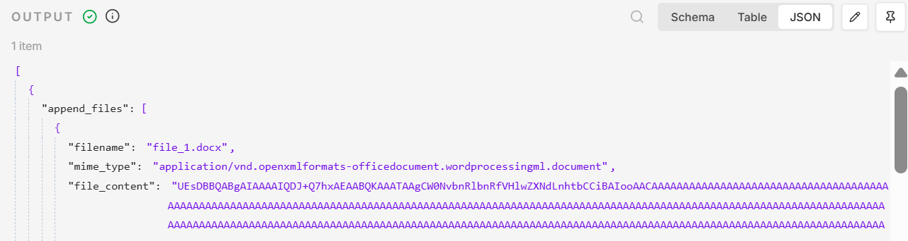

## For more information visit the [official documentation](https://www.cloudofficeprint.com/docs/n8n.html).
